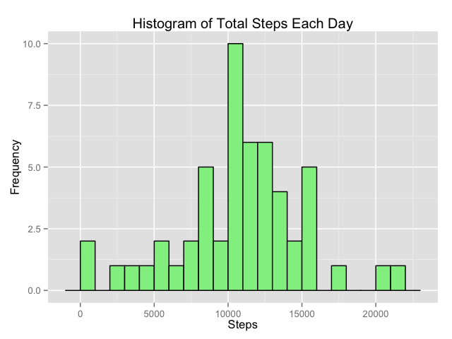
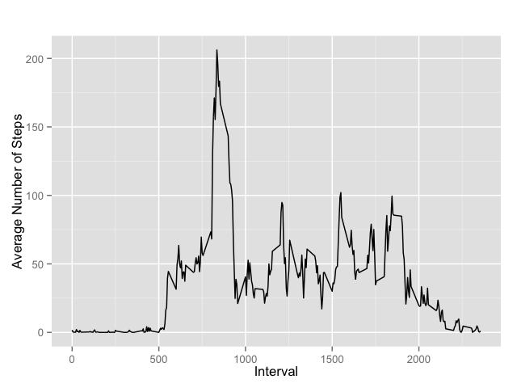
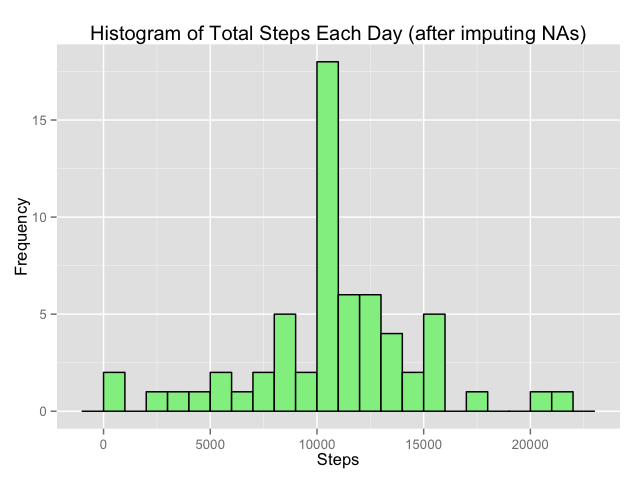
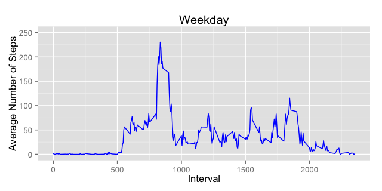
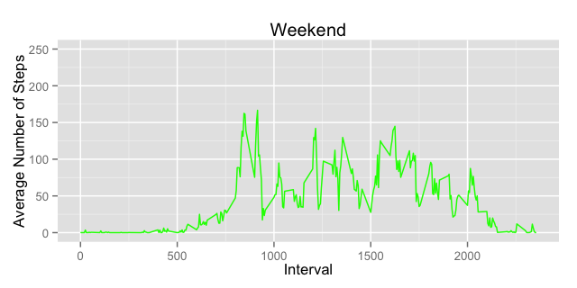
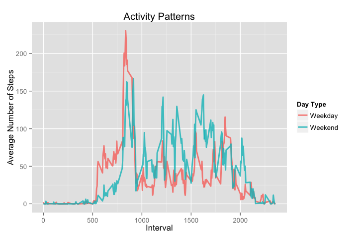

## Loading library packages

```{R echo=TRUE,results='hide',warning=FALSE,message=FALSE}
library(knitr)
library(dplyr)
library(ggplot2)

## checking existence of a folder named "figure", if not then creating one to store plot figures
figureDir <- 'figure'
if (!file.exists(figureDir)){
    dir.create(figureDir)
} 
```

## Loading and preprocessing the data
```{r echo=TRUE}
# reading csv file
rawData <- read.csv(file.path("data", "activity.csv"))

# processing data
## converting date column to POSIX time
rawData <- mutate(rawData, fullDate = as.POSIXct(rawData$date, format="%Y-%m-%d"))
## selecting neccessary columns
## adding another column to indicate type of a day (weekend or weekday type) 
## derived from POSIX time
data <- rawData %>%
        select(steps, fullDate, interval) %>%
        mutate(dayType = as.factor(ifelse(weekdays(fullDate) == "Sunday" | weekdays(fullDate) == "Saturday", "weekend", "weekday")))
```

## What is mean total number of steps taken per day?
``` {r echo=TRUE, fig.show='hide'}
## agrregating number of steps by date
sumOfSteps <- aggregate(data$steps, by = list(date = data$fullDate), sum)
head(sumOfSteps)

##plotting a histogram sum number of steps each day
qplot(sumOfSteps$x, geom="histogram", fill = I("lightgreen"), col = I("black"), xlab = "Steps", ylab = "Frequency", main = "Histogram of Total Steps Each Day", binwidth = 1000)
ggsave(file.path(figureDir, "plot1.png"), width=6.4, height=4.8, dpi=100)
```



```{r echo=TRUE}
## calculating mean and quantile
meanX <- mean(sumOfSteps$x, na.rm = TRUE)
quantileX <- quantile(sumOfSteps$x, probs = c(.5), na.rm = TRUE)
print(meanX)
print(quantileX)
```
The mean and the median of total number of steps taken per day are <strong>`r sprintf("%.2f", meanX)`</strong> and <strong>`r sprintf("%.2f", quantileX)`</strong>, respectively.

## What is the average daily activity pattern?
Calculate average on each 5-minute intervals
```{r echo = TRUE, fig.show='hide'}
## determining mean of steps over 5-minute interval (dropping NA values)
intervalData <- aggregate(data$steps, by = list(interval = data$interval), mean, na.rm = TRUE)
head(intervalData)

## plotting a line graph of daily pattern
p <- ggplot(data = intervalData, aes(x = interval, y = x))
p + geom_line()  + labs(x = "Interval", y = "Average Number of Steps", title = "")
ggsave(file.path(figureDir, "plot2.png"), width=6.4, height=4.8, dpi=100)
```



```{r echo=TRUE}
maxX <- max(intervalData$x)
intervalMax <- intervalData[which(intervalData$x == max(intervalData$x)), 1]
print(maxX)
print(intervalMax)
```
Maximum number of steps is <strong>`r sprintf("%.4f", maxX)`</strong> at 5-minute interval of <strong>`r sprintf("%04d", intervalMax)`</strong>

## Imputing missing values
```{r echo = TRUE}
ttlMissing <- nrow(data[is.na(data$steps),])
print(ttlMissing)
```
1. Total missing values is <strong>`r sprintf("%.0f", ttlMissing)`</strong>

2. Fill up NAs with median values of each interval
```{r echo = TRUE, fig.show='hide'}

## I couldn't find a better or more elegant way to replace NAs with mean values for each 
## interval.  The following commented out code using dplyr's mutate function is my direction to
# tackle the problem. However, it just worked on NAs data for the first day only.
# function(intv, intvDf) {
#        return(as.numeric(intvDf[which(intvDf$interval == intv), 2]))
#}
#newData <- mutate(data, cleanSteps = ifelse(is.na(data$steps), 
#       getMeanInterval(intv = data$interval, intvDf = intervalData), data$step))
#head(newData)

cleanSteps <- numeric() ## a temporary numeric array to store "steps" value
for(i in 1:nrow(data)) {        ## looping thru data
        ## if value of "steps" is NA then look up the mean of the same 5-minute interval
        ## in "intervalData"" data frame; attach the mean value to "cleanSteps"" array
        if(is.na(data[i, 1])){  
                intv <- data[i, 3]
                cleanSteps <- c(cleanSteps, intervalData[which(intervalData$interval == intv), 2])  
        }
        ## if value of "steps" is not NA, then attach the "steps" value to "cleanSteps"" array
        else {
                cleanSteps <- c(cleanSteps, data[i, 1]) 
        }
}

## creating "newData" data frame, which is a combination of data frame "data" bound with
## "cleanSteps" array
newData <- cbind(data, cleanSteps = cleanSteps)

## aggregating total of "cleanSteps" over data
newSumOfSteps <- aggregate(newData$cleanSteps, by = list(date = newData$fullDate), sum)
head(newSumOfSteps)

## plotting a new histogram
qplot(newSumOfSteps$x, geom="histogram", fill = I("lightgreen"), col = I("black"), xlab = "Steps", ylab = "Frequency", main = "Histogram of Total Steps Each Day (after imputing NAs)", binwidth = 1000)
ggsave(file.path(figureDir, "plot3.png"), width=6.4, height=4.8, dpi=100)
```



```{r echo=TRUE}
newMeanX <- mean(newSumOfSteps$x)
newQuantileX <- quantile(newSumOfSteps$x, probs = c(.5))
print(newMeanX)
print(newQuantileX)
```

After imputing missing values, new values for the mean and the median of total number of steps taken per day are <strong>`r sprintf("%.2f", newMeanX)`</strong> and <strong>`r sprintf("%.2f", newQuantileX)`</strong>.  The mean remains the same, but the median moves closer to the mean (in this case, they are almost identical). 

## Are there differences in activity patterns between weekdays and weekends?
In order to seperate data for weekday and weekend activities, a factor variable with two levels "weekday" and "weekend" has been created for the dataset. <i>(Please refer to data processing code section near the top of the page)</i>

``` {r echo=TRUE, fig.show='hide'}
## filtering interval data of weekdays
dataWD <- filter(newData, dayType == "weekday")
## agrregating "cleanSteps" over intervals
dataWD <- aggregate(dataWD$cleanSteps, by = list(interval = dataWD$interval), FUN = "mean")

## plotting weekday activity pattern
p2 <- ggplot(data = dataWD, aes(x = interval, y = x)) + geom_line(color = "blue")  + labs(x = "Interval", y = "Average Number of Steps", title = "Weekday") + ylim(0, 250)
ggsave(file.path(figureDir, "plot4.png"), width=6.4, height=3.2, dpi=100)

# filter interval data of weekends
dataWK <- filter(newData, dayType == "weekend")
## agrregating "cleanSteps" over intervals
dataWK <- aggregate(dataWK$cleanSteps, by = list(interval = dataWK$interval), FUN = "mean")

## plotting weekday activity pattern
p3 <- ggplot(data = dataWK, aes(x = interval, y = x)) + geom_line(color = "green")  + labs(x = "Interval", y = "Average Number of Steps", title = "Weekend") + ylim(0, 250)
ggsave(file.path(figureDir, "plot5.png"), width=6.4, height=3.2, dpi=100)
```




There are differences in activity patterns in term of average number of steps over 5-minute intervals, or in term of one interval comparing with others.  To have a better constrast between two activity patterns, both of them can be plotted in the same panel as follows: 
```{r echo=TRUE, fig.show='hide'}
##alternative plotting: combine 2 activity patterns in one plot
dTest <- group_by(newData, interval, dayType)
dTest <- summarise(dTest, average = mean(cleanSteps))

pTest <- ggplot(data = dTest, aes(x = interval, y = average, color = dayType))
pTest + geom_line(size=1, alpha = .8) +  aes(group = dayType) + 
    labs(x = "Interval", y = "Average Number of Steps", title = "Activity Patterns") + 
    scale_colour_discrete(name  ="Day Type",
                          breaks=c("weekday", "weekend"),
                          labels=c("Weekday", "Weekend"))

ggsave(file.path(figureDir, "plot6.png"), width=7.2, height=4.8, dpi=100)
```
